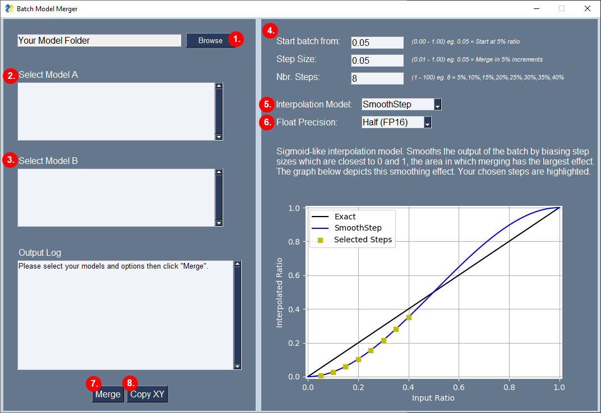
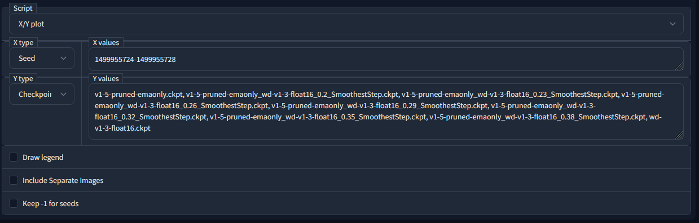

# Batch Checkpoint Merger

Python based application to automate batches of model checkpoint merges. The goal is to make it quick and easy to generate merges at many different ratios for the purposes of experimentation. 

It has been noted by some community members that merging model checkpoints at very small ratios can have a significant effect on the result. In an attempt to make these transitions smoother, there are various interpolation models included in the application for you to choose from. You can also use the "exact" mode which does not use any interpolation.

Installation instructions are geared towards users of  [Automatic's Webui](https://github.com/AUTOMATIC1111/stable-diffusion-webui). The application can run standalone if you are not using this (see "standalone installation" below)

  * [Installation & Start](#installation-&-start)
    + [Auto Installer](#auto-installer)
    + [Manual Installation](#manual-installation)
      - [Windows](#windows)
      - [Linux](#linux)
      - [macOS](#macos)
    + [Standalone Installation](#standalone-installation)
  * [Usage](#usage)
    + [Quick Start Guide](#quick-start-guide)
    + [Interpolation Models](#interpolation-models)
    + [X/Y Plotting](#xy-plotting)

## Installation & Start

The below steps have been tested using Win10 and Manjaro, if you are using a different OS you may need to modify these steps or follow the standalone installation, but it should _just work_ out of the box.

### Auto Installer

This is the easiest installation method. Running the launcher will install or update the app and then open it. 

- Download the launcher script from below (can also be found in "launcher_scripts" folder in this repo):
  - Windows: [win_install_update_run.bat](https://raw.githubusercontent.com/lodimasq/batch-checkpoint-merger/master/launcher_scripts/win_install_update_run.bat) (Right click > Save)
  - Linux: [linux_install_update_run.sh](https://raw.githubusercontent.com/lodimasq/batch-checkpoint-merger/master/launcher_scripts/linux_install_update_run.sh) (Right click > Save)
- (Optional) Rename the file to something memorable
- Move/save the script to your stable-diffusion-webui folder (the same folder you run webui-user.bat/sh from)
- Open the script and the application should install and open. The application will auto-update.
- That's it!

### Manual Installation

If you do not want auto-update or having issues with the auto installer, you can do so manually as below:

#### Windows

 - Open a command prompt
 - Navigate to your stable-diffusion-webui folder
   - ```cd C:\MyFilePath\stable-diffusion-webui```
 - Activate the venv
   - ```venv\scripts\activate```
   - _If done correctly you will see (venv) in front of your command line_
 - Install the package using pip
   - ```pip install batch_checkpoint_merger```
 - To run the application once installed use any of the below methods
   - From inside the venv:
     - ```pythonw -m batch_checkpoint_merger```
   - From a command prompt in the stable-diffusion-webui folder:
     - ```start venv\Scripts\pythonw.exe -m batch_checkpoint_merger```
   - Using the launcher script from the repo: [win_run_only.bat](https://raw.githubusercontent.com/lodimasq/batch-checkpoint-merger/master/launcher_scripts/win_run_only.bat) (Right click > Save)
     - (Optional) Rename the file to something memorable
     - Move/save to your stable-diffusion-webui folder
     - Run the script to open

#### Linux

 - Open a terminal window
 - Navigate to your stable-diffusion-webui folder
   - ```cd /home/MyFilePath/stable-diffusion-webui```
 - Activate the venv
   - ```source /venv/bin/activate```
 - Install the package using pip
   - ```pip install batch_checkpoint_merger```
- To run the application once installed use any of the below methods
   - From inside the venv using nohup: ```nohup python -m batch_checkpoint_merger >/dev/null 2>&1 &```
   - From inside the venv without nohup: ```python -m batch_checkpoint_merger``` (**Not Recommended:** Will block your terminal window and dump log lines)
   - Using the launcher script from the repo: [linux_run_only.sh](https://raw.githubusercontent.com/lodimasq/batch-checkpoint-merger/master/launcher_scripts/linux_run_only.sh) (Right click > Save)
     - (Optional) Rename the file to something memorable
     - Make the file executable ```chmod +x```
     - Move/save to your stable-diffusion-webui folder
     - Run the script to open

#### macOS

- I don't have a macOS device to test with but the above Linux instructions _should(?)_ work
- If you run into problems please reach out and I will try to assist

### Standalone Installation

- Open your CLI of choice
- Activate your python venv (optional but recommended)
  - _Torch is a dependency for this package, if you have a venv with torch already installed you probably want to use that one_
- Install the package using pip
  - ```pip install batch_checkpoint_merger```
- To run the application once installed
  - ```python -m batch_checkpoint_merger```
  - **Note:** This will block your terminal window and spit out the application log. I would recommend instead to launch it using pythonw (Windows) or nohup (Linux/MacOS)

## Usage

### Quick Start Guide



1. Select your model folder (usually stable-diffusion-webui\models\Stable-diffusion)
2. Select your first model. This is the "base" model that we will be merging into
3. Select your second model. This is the "new" model you will be merging on top of the first model
4. Configure your batch size
    - Start from. The ratio used for the first merge in the batch (0.05 = 5%)
    - Step size. How much to increase the ratio for each merge in the batch (0.05 = 5%)
    - Nbr. Steps. How many merges you want to be created in the batch
    - _Updating these values will refresh the graph, this is explained in the next section_
5. Interpolation model. Select the interpolation model to be applied to the batch. _Interpolation models explained in the next section, if you do not want any interpolation select "exact"_
6. Float precision. Default value of FP16 is correct in 99% of cases. If you need to merge at FP32 you can select it here
7. Merge. Click this button to start the batch. Output models will be saved in a subdirectory of your models directory named "~batch_merges". (If using webui you can just hit the refresh button next to the model list once complete)
8. Copy XY. This will copy a comma separated list of the output models from this batch. Useful for XY plotting (_explained below_)

### Interpolation Models

Included in the app are three different interpolation models; SmoothStep, SmootherStep and SmoothestStep. Each of these apply a sigmoid-like function to your selected ratios to smooth out the transition between steps. This functionality used to be included in Automatic's webui but was removed due to the lack of clarity for users. The graph shown in the application is made in an effort to make it clearer what is happening.

Each step in your merge batch that you select will have the chosen interpolation function applied to it. This means that the actual ratio the models are merged at will be somewhat different to the ones you initially selected. Along the x-axis (bottom) of the graph is the ratio you selected in the batch configuration above. In the y-axis (left) of the graph is the ratio that the app will use to create your checkpoint merge. You can play around with your configuration and see the graph update each time (may need to click on a different box to update the graph).

To read more about these functions, please see this wiki page on the topic: [https://en.wikipedia.org/wiki/Smoothstep](https://en.wikipedia.org/wiki/Smoothstep)

If you wish to disable interpolation entirely, simply select "exact" as your interpolation method.

### X/Y Plotting

Now that you have created a batch of checkpoint merges, how do you test them all? The easiest way is to use the X/Y plot functionality in Automatic's webui. The "Copy XY" button will copy to the clipboard a comma separated list of model names to make this workflow much quicker and easier.

- Load up a prompt you wish to use for testing and select the "X/Y Plot" script
- Set the "Y type" to "Checkpoint Name"
- Paste the XY string into the "Y values" box
- (Optional) set the "X type" to a variable you want to iterate over (Seed is a good place to start)
- Add some seed values to the "X values" box
- Click generate



The first and last row of images in each plot will be the Model A and Model B in their raw form (for reference). Once you find a ratio you like, you can rename your model and move it into the main directory (and delete any you don't need). You may also want to run the batch again with a smaller step size focusing on a finer range of ratios.

Below is an example created using SD1.5 and WD1.3. The settings used to create this batch are as follows:
- Start batch from: 0.2
- Step size: 0.03
- Nbr. Steps: 8
- Interpolation Method: SmoothestStep

(Left to right is seed, top to bottom is merge ratio)

